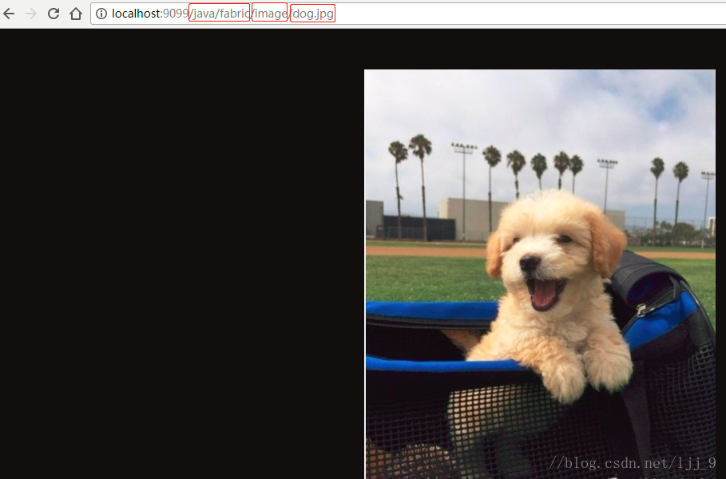

# springboot

## Spring Boot 表单验证

# [纯洁的微笑   Spring Boot 系列文章](http://www.ityouknow.com/spring-boot.html)

[Spring Boot 表单验证篇](https://www.bysocket.com/?p=1942)


校验框架 spring-boot-starter-validation
```xml
<!-- https://mvnrepository.com/artifact/org.springframework.boot/spring-boot-starter-validation -->
<dependency>
    <groupId>org.springframework.boot</groupId>
    <artifactId>spring-boot-starter-validation</artifactId>
    <version>2.1.3.RELEASE</version>
</dependency>
```

## 对象转换java：dozer

Dozer 使用小结

https://www.cnblogs.com/jingmoxukong/p/5952447.html


## Spring Security

1. [Spring Boot 整合Spring Security](https://netfilx.github.io/spring-boot/11.springboot-security/springboot-security)

2. [SpringBoot + Spring Security 基本使用及个性化登录配置详解](https://www.jb51.net/article/140429.htm)

3. [Spring boot + Spring Security 实现用户登录管理](https://blog.csdn.net/wtopps/article/details/78297197)

4. [springboot系列：原始登录验证实现](https://blog.csdn.net/huang906391/article/details/78376766/)

## 静态文件服务器

[springboot 配置静态资源做简单的文件服务器](https://www.jianshu.com/p/4dd5be065f71)

## [spring boot 直接通过url访问获取内部或者外部静态资源图片](https://blog.csdn.net/ljj_9/article/details/79650008)

第一种方式，在代码上配置

```java
@Configuration
public class WebMvcConfiguration extends WebMvcConfigurerAdapter {

    @Override
    public void addResourceHandlers(ResourceHandlerRegistry registry) {
    
        //addResourceHandler是指你想在url请求的路径
        //addResourceLocations是图片存放的真实路径
    
        registry.addResourceHandler("/image/**").addResourceLocations("file:D://User/");
        super.addResourceHandlers(registry);
     }
}

```

第二种方式，在配置文件中配置

```java
#资源映射路径为/image/**，你想在url访问的请求路径
spring.mvc.static-path-pattern=/image/**
#资源映射地址为file:D://User/，图片存放的真实路径

spring.resources.static-locations=file:D://User/ 
```


如下图，看浏览器的地址栏，框框标志第一部分是我的项目名，框框标志第二部分就是上面配置的映射路径（会映射到图片存放的真实路径），框框标志第三部分就是我的图片文件名，通过上面两种方式随便一种，就可以直接在浏览器通过url访问获取图片了。




## ISSUE

[解决Springboot中给Interceptor配置的excludePathPatterns无效的问题](https://blog.csdn.net/turbo_zone/article/details/84454193)